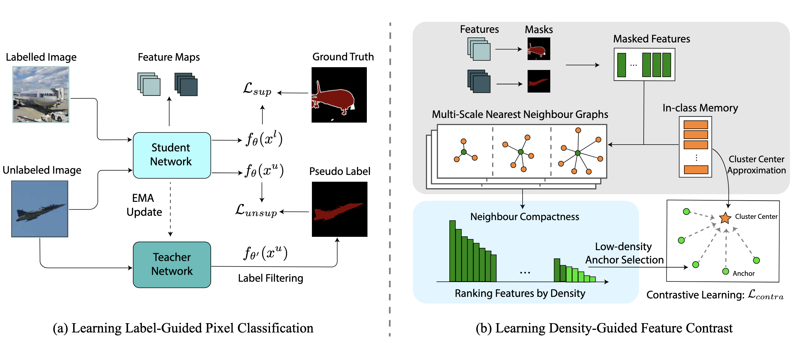

## Hunting Sparsity: Density-Guided Contrastive Learning for Semi-Supervised Semantic Segmentation

> **[Hunting Sparsity: Density-Guided Contrastive Learning for Semi-Supervised Semantic Segmentation](https://openaccess.thecvf.com/content/CVPR2023/papers/Wang_Hunting_Sparsity_Density-Guided_Contrastive_Learning_for_Semi-Supervised_Semantic_Segmentation_CVPR_2023_paper.pdf)**<br>
> Xiaoyang Wang, Bingfeng Zhang, Limin Yu, and Jimin Xiao.<br>
> In CVPR 2023.<br>

<div align=center></div><br/>

<!-- [YouTube](https://www.youtube.com/watchwatch?v=o0jEox4z3OI)<br> -->
> **Abstract:** *Inspired by density-based unsupervised clustering, we propose to leverage feature density to locate sparse regions within feature clusters defined by label and pseudo labels. The hypothesis is that lower-density features tend to be under-trained compared with those densely gathered. Therefore, we propose to apply regularization on the structure of the cluster by tackling the sparsity to increase intra-class compactness in feature space. With this goal, we present a Density-Guided Contrastive Learning (DGCL) strategy to push anchor features in sparse regions toward cluster centers approximated by high-density positive keys. The heart of our method is to estimate feature density which is defined as neighbor compactness. We design a multi-scale density estimation module to obtain the density from multiple nearest-neighbor graphs for robust density modeling. Moreover, a unified training framework is proposed to combine label-guided self-training and densityguided geometry regularization to form complementary supervision on unlabeled data.*


## Getting Started

### Installation

```bash
cd DGCL
conda create -n dgcl python=3.10
conda activate dgcl
pip install -r requirements.txt
```

### Pretrained Weights

Download pretrained wegiths [ResNet-101](https://drive.google.com/file/d/1p3d2EZMNgSu0v-fQHk3pPpOygwraqyFP/view?usp=sharing)

```
├── DGCL/
    └── resnet101.pth
```

### Data Preparation
<!-- 
- Pascal: [JPEGImages](http://host.robots.ox.ac.uk/pascal/VOC/voc2012/VOCtrainval_11-May-2012.tar) | [SegmentationClass](https://drive.google.com/file/d/1ikrDlsai5QSf2GiSUR3f8PZUzyTubcuF/view?usp=sharing)
- Cityscapes: [leftImg8bit](https://www.cityscapes-dataset.com/file-handling/?packageID=3) | [gtFine](https://drive.google.com/file/d/1E_27g9tuHm6baBqcA7jct_jqcGA89QPm/view?usp=sharing) -->

```
├── Path_to_Pascal
    ├── JPEGImages
    └── SegmentationClassAug
    
├── Path_to_Cityscapes
    ├── leftImg8bit
    └── gtFine
```


## Training
 
Navigate into `experiments/pascal/732` and modify `config.yaml` and `train.sh`. 
```
sh train.sh <num_gpu> <port>
```


## Citation
```bibtex  
@inproceedings{wang2023dgcl,
  title= {Hunting Sparsity: Density-Guided Contrastive Learning for Semi-Supervised Semantic Segmentation},
  author={Wang, Xiaoyang and Zhang, Bingfeng and Yu, Limin and Xiao, Jimin},
  booktitle={CVPR},
  year={2023},
}
```

## Acknowledgement
This project borrows codes from [U2PL](https://github.com/izmailovpavel/flowgmm) and [ReCo](https://github.com/lorenmt/reco). Thanks for their great work!


## Contact
For questions, please contact: wangxy@liverpool.ac.uk